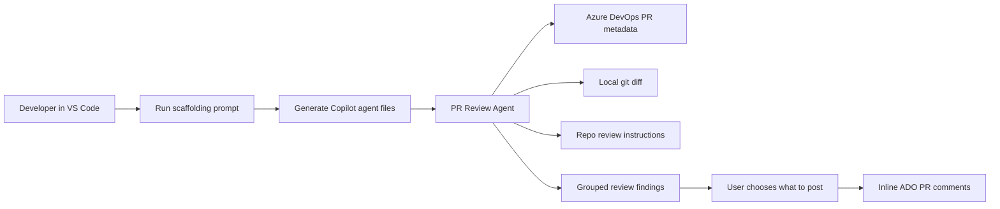

# Azure DevOps PR Review Agent for GitHub Copilot

> Review Azure DevOps pull requests with GitHub Copilot from inside VS Code — without setting up an MCP server, webhook, pipeline task, or separate review service.

GitHub Copilot has strong support for code review, but teams using **Azure DevOps Repos** do not get the same smooth PR review experience as GitHub-hosted repositories. This repository helps bridge that gap by generating a local **GitHub Copilot custom agent** that can review Azure DevOps pull requests using your existing local tools: **Git**, **VS Code**, **GitHub Copilot**, and the **Azure CLI**.

The result is a repo-tailored PR review agent that can:

- read an Azure DevOps pull request,
- fetch the correct git diff locally,
- inspect only the surrounding code it needs,
- apply your repository’s own review standards,
- group findings by confidence,
- and let you choose which comments to post back to Azure DevOps.

It does **not** edit code, push commits, approve PRs, reject PRs, or change PR state. It is designed as a reviewer assistant, not an automated gatekeeper.

This project started as a CLI-based adaptation of [`segunak/azure-devops-github-copilot-pr-review`](https://github.com/segunak/azure-devops-github-copilot-pr-review). The main differences are that this version uses the **Azure CLI directly** instead of the Azure DevOps MCP server, and that the generated agent is designed to stay closer to the PR diff so it spends fewer tokens reading unrelated files.

## Prerequisites

You need:

- VS Code with GitHub Copilot enabled.
- Git.
- Azure CLI.
- The Azure DevOps Azure CLI extension.
- Access to the Azure DevOps repository you want to review.
- `jq` if you use the Unix prompt.

Install and authenticate Azure CLI:

```powershell
az login
az extension add --name azure-devops
```

On macOS/Linux, the same commands apply:

```bash
az login
az extension add --name azure-devops
```

## Quick start

### 1. Copy the scaffolding prompt into your repository

Pick the prompt for your operating system (`create-pr-review-agent-windows.prompt.md` for Windows/PowerShell or `create-pr-review-agent-unix.prompt.md` for macOS/Linux) and copy it into the repository you want to enable PR reviews for:

```text
.github/prompts/create-pr-review-agent.prompt.md
```

For example, on Windows you copy:

```text
create-pr-review-agent-windows.prompt.md
```

to:

```text
.your-repo/.github/prompts/create-pr-review-agent.prompt.md
```

The file name and location matter because this is what creates the `/createPrReviewAgent` command in Copilot Chat.

### 2. Run the scaffolding prompt in VS Code

Open your repository in VS Code, open Copilot Chat, and run:

```text
/createPrReviewAgent
```

The prompt will:

- detect your Azure DevOps org, project, repo, and default branch from `git remote`,
- ask you to confirm the detected values,
- scan the repo for languages, tests, conventions, and existing instruction files,
- check that Azure CLI is available,
- then generate the Copilot agent files.

### 3. Review the generated instructions

Open this file:

```text
.github/instructions/code-review.instructions.md
```

The scaffolding prompt makes a first pass based on your repo, but you should edit it to match your team’s actual standards. This is the most important customization point.

### 4. Commit the generated files

Commit and push the generated `.github` files so the agent is available to everyone working in the repo.

```bash
git add .github
git commit -m "Add Azure DevOps PR review Copilot agent"
git push
```

## How it works



At a high level:

1. You add the scaffolding prompt to your repository.
2. Copilot reads your repo and generates a PR review agent.
3. The agent uses Azure CLI and git to review PRs.
4. You approve which findings should be posted.
5. The agent posts selected findings as inline Azure DevOps PR comments.


## What gets generated

The scaffolding prompt creates or updates these files in your repository:

| File | Purpose |
| --- | --- |
| `.github/agents/pr-review.agent.md` | The custom Copilot PR review agent. |
| `.github/instructions/code-review.instructions.md` | Team review standards, seeded from a quick scan of your repo. |
| `.github/instructions/azure-devops-cli.instructions.md` | Azure DevOps CLI runbook used by the agent. |
| `.github/prompts/pr-review.prompt.md` | Adds a `/prReview` slash command. |
| `.github/copilot-instructions.md` | Repository context for GitHub Copilot. Existing content is merged, not overwritten. |

## Choose the prompt for your system

| Your environment | Use this prompt |
| --- | --- |
| Windows / PowerShell | `create-pr-review-agent-windows.prompt.md` |
| macOS / Linux / Unix shell | `create-pr-review-agent-unix.prompt.md` |

The Windows version is PowerShell-specific and includes several guardrails for real Azure CLI and PowerShell quirks.


## Running a PR review

After setup, you can use either of these flows in VS Code Copilot Chat:

### Option A: Use the agent directly

Select the `pr-review` agent from the Copilot Chat agent dropdown and provide a PR number or PR URL:

```text
1234
```

or:

```text
https://dev.azure.com/your-org/your-project/_git/your-repo/pullrequest/1234
```

### Option B: Use the slash command

Run:

```text
/prReview
```

Then provide the PR number or URL when asked.

The agent will:

1. verify that Azure CLI is installed, authenticated, and has the Azure DevOps extension,
2. read your repo’s review instructions,
3. fetch PR metadata from Azure DevOps,
4. fetch the source and target branches locally,
5. review the git diff,
6. read surrounding code only where needed,
7. group findings into `ready to post`, `needs more evidence`, and `likely noise`,
8. ask what you want to post,
9. post selected findings as inline Azure DevOps PR comments.

## Manual setup

You can also skip the scaffolding prompt and copy the example files directly.

1. Copy either `example-windows/.github/` or `example-unix/.github/` into your repository.
2. Replace the placeholder values in the generated files:
   - `__ADO_ORG__`
   - `__ADO_PROJECT__`
   - `__ADO_REPO__`
   - `__DEFAULT_BRANCH__`
   - `__ORG_URL__`
3. Edit `.github/instructions/code-review.instructions.md` to match your team.
4. Commit and push the files.

The scaffolding flow is recommended because it detects your repo context and avoids several manual mistakes.

## Customization

You can customize the generated setup in a few places:

| What you want to change | Where to change it |
| --- | --- |
| Review standards | `.github/instructions/code-review.instructions.md` |
| Extra team-specific instructions | Add more files under `.github/instructions/` |
| Agent behavior | `.github/agents/pr-review.agent.md` |
| Azure CLI recipes | `.github/instructions/azure-devops-cli.instructions.md` |
| Slash command text | `.github/prompts/pr-review.prompt.md` |

The safest customization point is the review standards file. Be more careful when changing the Azure CLI runbook; the commands are intentionally written to avoid known PowerShell, JSON, and Azure CLI edge cases.

## Credits

This project was inspired by and based on the excellent [`segunak/azure-devops-github-copilot-pr-review`](https://github.com/segunak/azure-devops-github-copilot-pr-review) project.

That version uses the Azure DevOps MCP server. This repo explores a simpler Azure CLI-based variant for teams that prefer not to set up MCP or want to rely on tooling they already have installed.

## License

MIT
